# AI Database Text-to-SQL Engine v2 — Complete Architecture, Pipelines & Flowcharts

> **Comprehensive Visual Guide to the System Architecture, 6-Layer Accuracy Pipeline, Multi-Tenant Security, and Execution Workflows**  
> *Project: `chatbot_v2` | Single-Server Text-to-SQL Engine (Port 8000)*

---

## 📑 Table of Contents

1. [High-Level System Architecture](#1-high-level-system-architecture)
2. [End-to-End Request / Response Lifecycle](#2-end-to-end-request--response-lifecycle)
3. [The 6-Layer Accuracy Pipeline](#3-the-6-layer-accuracy-pipeline)
   - [Layer 1: Query Intelligence Engine](#layer-1-query-intelligence-engine)
   - [Layer 2: Hybrid Retrieval & RAG Pipeline](#layer-2-hybrid-retrieval--rag-pipeline)
   - [Layer 3: Schema Graph Engine (GraphRAG)](#layer-3-schema-graph-engine-graphrag)
   - [Layer 4: Context Assembly & Dynamic Prompt Budgeting](#layer-4-context-assembly--dynamic-prompt-budgeting)
   - [Layer 5: LLM Orchestrator & Multi-Provider Circuit Breakers](#layer-5-llm-orchestrator--multi-provider-circuit-breakers)
   - [Layer 6: AST Security Validation & Self-Correction Feedback Loop](#layer-6-ast-security-validation--self-correction-feedback-loop)
4. [Multi-Turn Conversational Context Engine](#4-multi-turn-conversational-context-engine)
5. [Multi-Tenant Security & AST Validation Architecture](#5-multi-tenant-security--ast-validation-architecture)
6. [Offline Database Introspection & ChromaDB Vector Indexing](#6-offline-database-introspection--chromadb-vector-indexing)
7. [Component & Directory Cross-Reference](#7-component--directory-cross-reference)

---

## 1. High-Level System Architecture

The following diagram illustrates the high-level boundary of the **Chatbot v2** platform, mapping external clients, gateway security, core pipeline engines, in-memory caches, and upstream model providers.

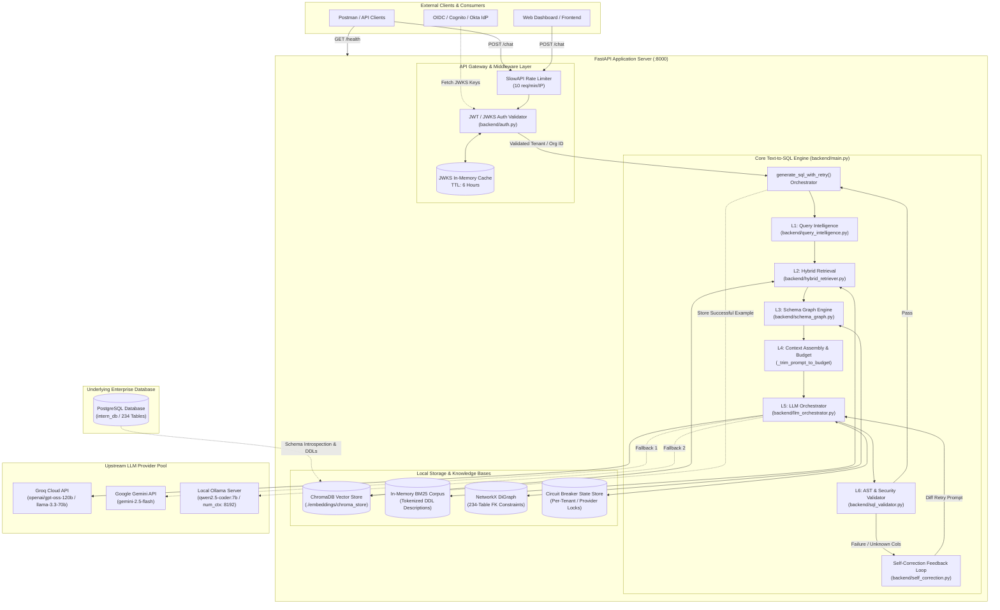

---

## 2. End-to-End Request / Response Lifecycle

Every HTTP request to `POST /chat` goes through strict validation, context retrieval, multi-strategy ranking, multi-model execution, and security gating.

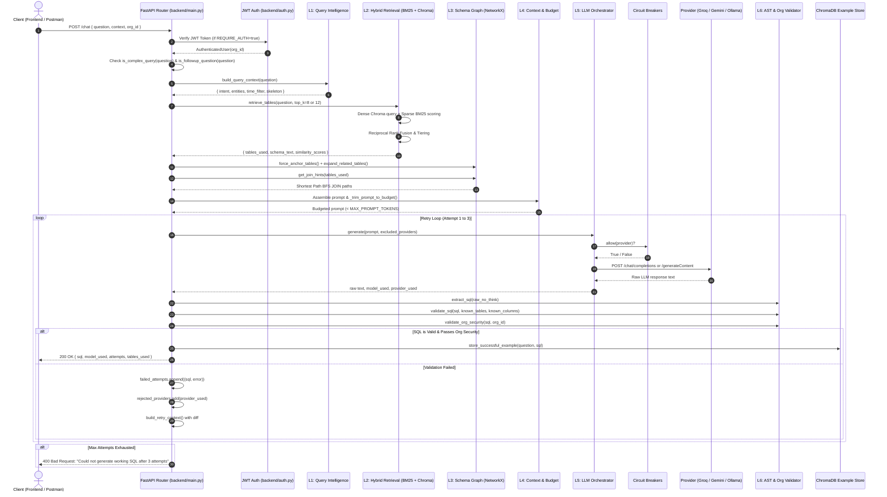

---

## 3. The 6-Layer Accuracy Pipeline

### Layer 1: Query Intelligence Engine
**File:** [`backend/query_intelligence.py`](file:///c:/Users/kisho/OneDrive/Desktop/chatbot_v2/backend/query_intelligence.py)

Classifies natural language questions into formal query intents, maps keywords to database tables, extracts exact filter values, and prepares a deterministic SQL skeleton.

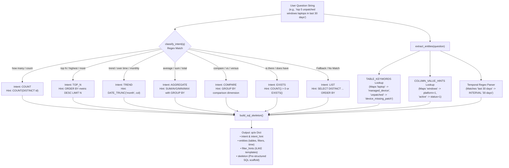

---

### Layer 2: Hybrid Retrieval & RAG Pipeline
**Files:** [`backend/hybrid_retriever.py`](file:///c:/Users/kisho/OneDrive/Desktop/chatbot_v2/backend/hybrid_retriever.py), [`embeddings/retrieve.py`](file:///c:/Users/kisho/OneDrive/Desktop/chatbot_v2/embeddings/retrieve.py)

Combines **dense semantic search** with **sparse keyword search (BM25)** using **Reciprocal Rank Fusion (RRF)** to pick the top-K tables out of 234 schema tables.

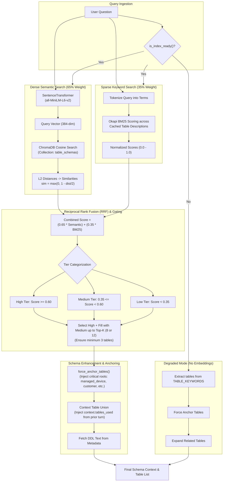

---

### Layer 3: Schema Graph Engine (GraphRAG)
**File:** [`backend/schema_graph.py`](file:///c:/Users/kisho/OneDrive/Desktop/chatbot_v2/backend/schema_graph.py)

Uses **NetworkX** to construct a bi-directional directed graph of all 234 tables and their foreign-key constraints. Eliminates hallucinated joins by computing the shortest join path and injecting junction/connector tables.

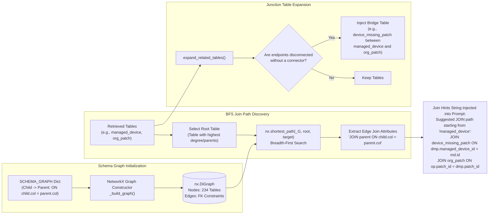

---

### Layer 4: Context Assembly & Dynamic Prompt Budgeting
**File:** [`backend/main.py`](file:///c:/Users/kisho/OneDrive/Desktop/chatbot_v2/backend/main.py)

Assembles the system prompt, guidelines, conversation history, schema DDLs, few-shot examples, and skeletons, then runs a progressive token shedding algorithm to guarantee strict adherence to LLM context limits.

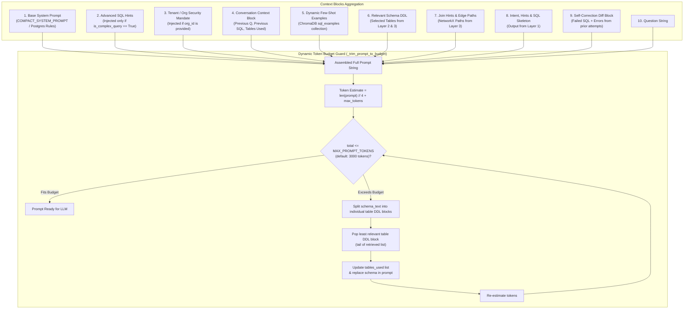

---

### Layer 5: LLM Orchestrator & Multi-Provider Circuit Breakers
**Files:** [`backend/llm_orchestrator.py`](file:///c:/Users/kisho/OneDrive/Desktop/chatbot_v2/backend/llm_orchestrator.py), [`backend/llm_config.py`](file:///c:/Users/kisho/OneDrive/Desktop/chatbot_v2/backend/llm_config.py), [`backend/llm_registry.py`](file:///c:/Users/kisho/OneDrive/Desktop/chatbot_v2/backend/llm_registry.py)

Manages request-scoped routing across **Groq**, **Google Gemini**, and **Local Ollama/Qwen**, armed with dynamic thread-safe circuit breakers, error classification, and transparent failover.

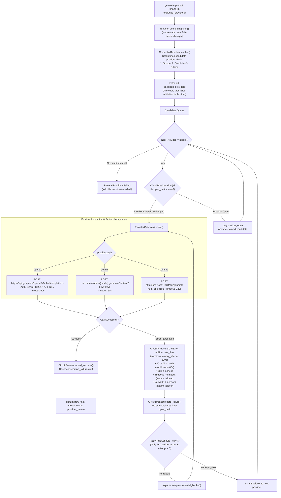

#### Circuit Breaker State Transition Diagram

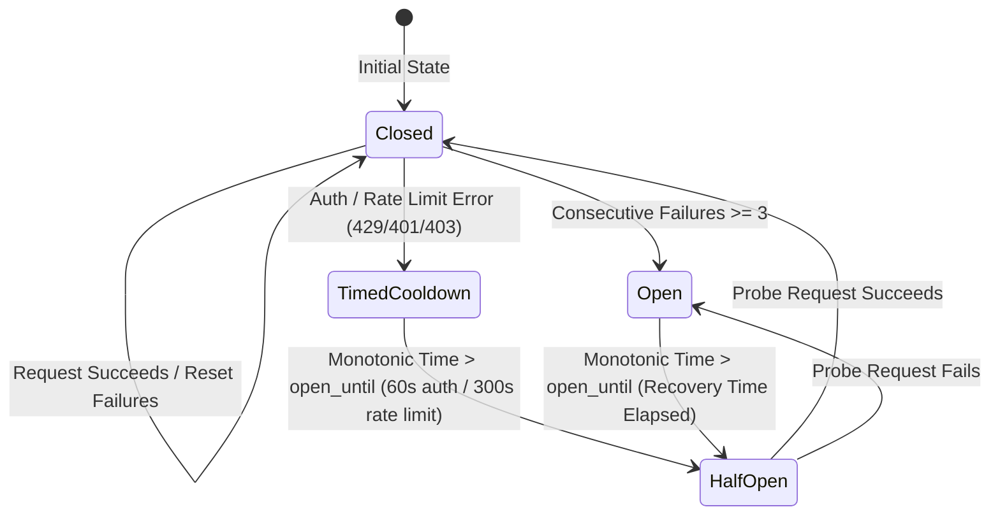

---

### Layer 6: AST Security Validation & Self-Correction Feedback Loop
**Files:** [`backend/sql_validator.py`](file:///c:/Users/kisho/OneDrive/Desktop/chatbot_v2/backend/sql_validator.py), [`backend/self_correction.py`](file:///c:/Users/kisho/OneDrive/Desktop/chatbot_v2/backend/self_correction.py)

Acts as the immutable security barrier and accuracy loop. Sanitizes LLM outputs, enforces AST schema correctness, verifies tenant isolation, and powers the self-correction engine.

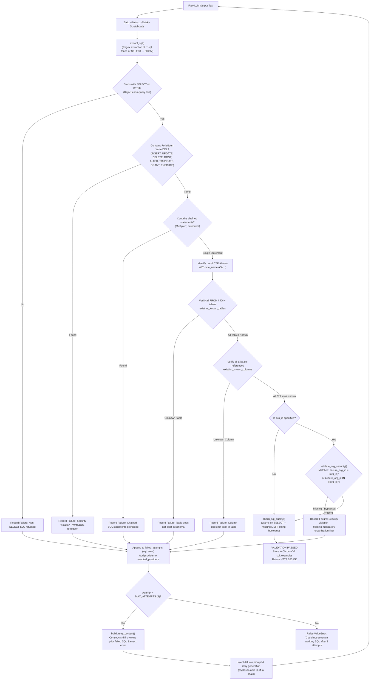

---

## 4. Multi-Turn Conversational Context Engine

Enables intelligent context continuity so users can issue natural conversational follow-ups without repeating the full context.

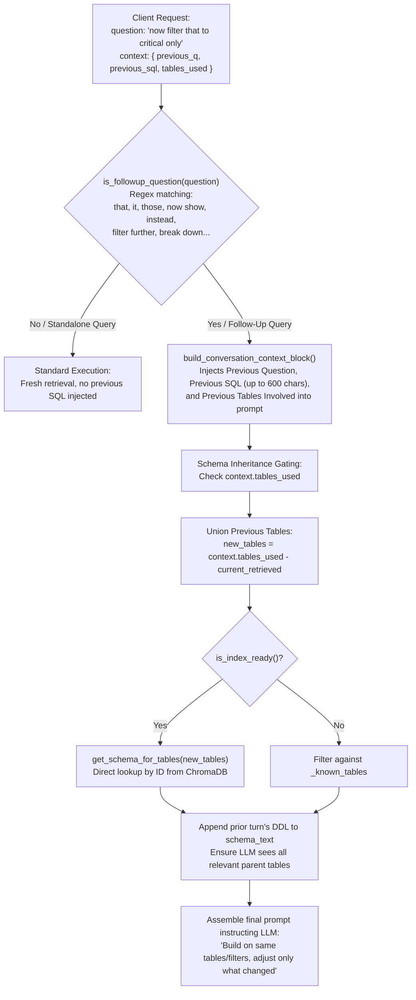

---

## 5. Multi-Tenant Security & AST Validation Architecture

A defense-in-depth visual of how tenant isolation (`zecure_org_id`) is strictly enforced at every level of the pipeline without administrative bypass.

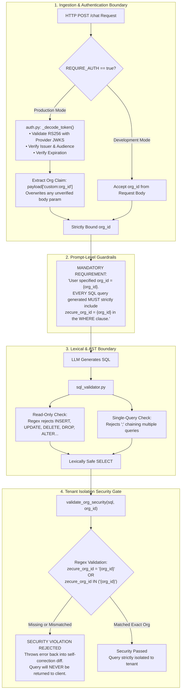

---

## 6. Offline Database Introspection & ChromaDB Vector Indexing
**Files:** [`embeddings/schema_introspect.py`](file:///c:/Users/kisho/OneDrive/Desktop/chatbot_v2/embeddings/schema_introspect.py), [`embeddings/build_index.py`](file:///c:/Users/kisho/OneDrive/Desktop/chatbot_v2/embeddings/build_index.py)

The offline pipeline that syncs the real 234-table PostgreSQL database schema into ChromaDB with rich metadata and incremental change detection.

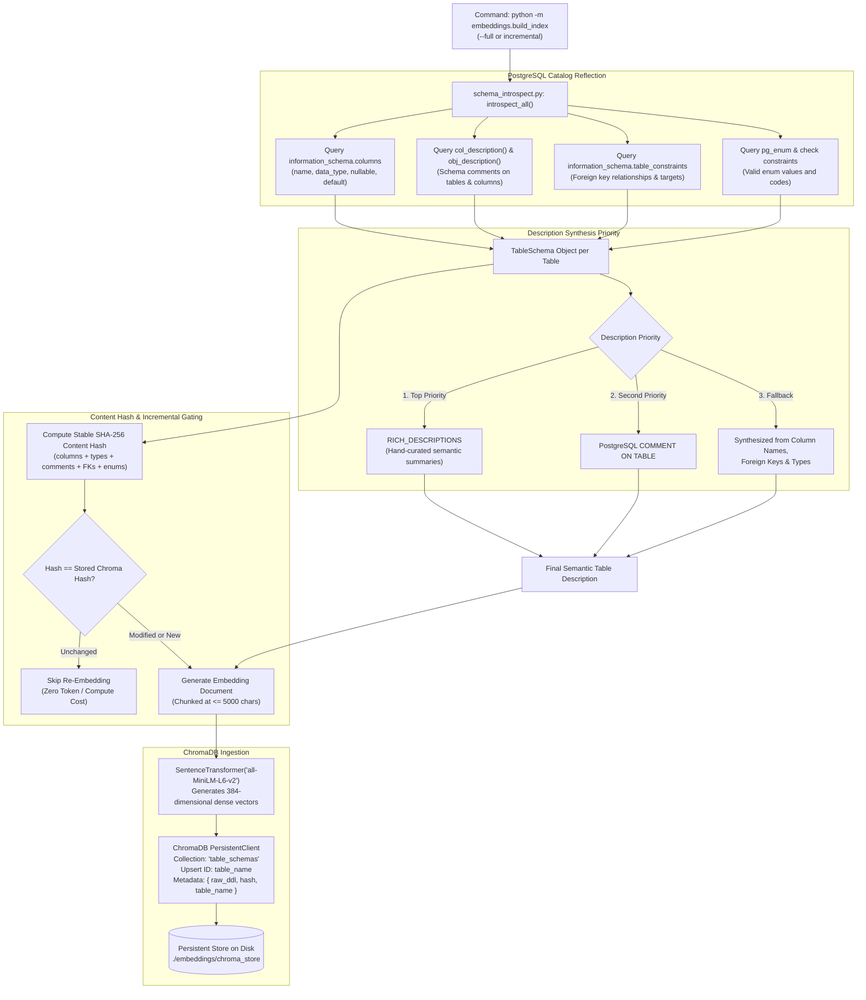

---

## 7. Component & Directory Cross-Reference

| Layer / Subsystem | Primary Code File | Key Functions & Classes | Primary Responsibilities |
| :--- | :--- | :--- | :--- |
| **API Entrypoint** | [`backend/main.py`](file:///c:/Users/kisho/OneDrive/Desktop/chatbot_v2/backend/main.py) | `chat()`, `health()`, `generate_sql_with_retry()`, `_trim_prompt_to_budget()` | FastAPI router, lifespan setup, token budgeting, pipeline execution loop. |
| **L1: Query Intelligence** | [`backend/query_intelligence.py`](file:///c:/Users/kisho/OneDrive/Desktop/chatbot_v2/backend/query_intelligence.py) | `classify_intent()`, `extract_entities()`, `build_sql_skeleton()`, `build_query_context()` | Intent mapping (7 classes), entity dictionary (234 tables), temporal parsing. |
| **L2: Hybrid Retrieval** | [`backend/hybrid_retriever.py`](file:///c:/Users/kisho/OneDrive/Desktop/chatbot_v2/backend/hybrid_retriever.py) | `retrieve_tables()`, `_bm25_scores()`, `get_similar_examples()`, `store_successful_example()` | BM25 sparse + ChromaDB dense retrieval, RRF scoring, tiered table gating. |
| **L2: Vector Query Interface** | [`embeddings/retrieve.py`](file:///c:/Users/kisho/OneDrive/Desktop/chatbot_v2/embeddings/retrieve.py) | `retrieve_relevant_tables()`, `is_index_ready()`, `_get_model()` | ChromaDB collection connection, sentence transformer singleton, RRF ranking. |
| **L3: Schema Graph** | [`backend/schema_graph.py`](file:///c:/Users/kisho/OneDrive/Desktop/chatbot_v2/backend/schema_graph.py) | `get_join_hints()`, `find_join_path()`, `expand_related_tables()`, `force_anchor_tables()` | NetworkX BFS shortest-path join discovery, bridge table expansion. |
| **L4: Prompts & Rules** | [`backend/prompts.py`](file:///c:/Users/kisho/OneDrive/Desktop/chatbot_v2/backend/prompts.py) | `get_system_prompt()`, `COMPACT_SYSTEM_PROMPT` | Postgres guidelines, integer platform/status mappings, few-shot prompts. |
| **L5: LLM Orchestrator** | [`backend/llm_orchestrator.py`](file:///c:/Users/kisho/OneDrive/Desktop/chatbot_v2/backend/llm_orchestrator.py) | `LLMOrchestrator.generate()`, `ProviderGateway`, `CredentialBreakerStore` | Multi-LLM failover (Groq &rarr; Gemini &rarr; Ollama), request-scoped circuit breakers. |
| **L5: LLM Configuration** | [`backend/llm_config.py`](file:///c:/Users/kisho/OneDrive/Desktop/chatbot_v2/backend/llm_config.py) | `RuntimeConfig`, `RuntimeConfigSnapshot`, `system_llm_status()` | Zero-restart hot reloading of `.env`, fallback chain definition. |
| **L5: LLM Registry** | [`backend/llm_registry.py`](file:///c:/Users/kisho/OneDrive/Desktop/chatbot_v2/backend/llm_registry.py) | `get_provider()`, `PROVIDERS`, `ProviderDefinition` | Provider metadata, endpoints, authentication headers, default models. |
| **L6: AST & Org Validator** | [`backend/sql_validator.py`](file:///c:/Users/kisho/OneDrive/Desktop/chatbot_v2/backend/sql_validator.py) | `extract_sql()`, `validate_sql()`, `validate_org_security()` | Read-only verification, CTE tracking, table/column verification, tenant isolation. |
| **L6: Self-Correction** | [`backend/self_correction.py`](file:///c:/Users/kisho/OneDrive/Desktop/chatbot_v2/backend/self_correction.py) | `build_retry_context()`, `check_sql_quality()` | Diff formatting for retries, warnings for `SELECT *` and unindexed filters. |
| **Security & Auth** | [`backend/auth.py`](file:///c:/Users/kisho/OneDrive/Desktop/chatbot_v2/backend/auth.py) | `get_current_user()`, `_decode_token()`, `_fetch_jwks()` | OIDC / JWKS RS256 token validation, 6-hour key cache, `org_id` claim extraction. |
| **Offline Schema Introspection** | [`embeddings/schema_introspect.py`](file:///c:/Users/kisho/OneDrive/Desktop/chatbot_v2/embeddings/schema_introspect.py) | `introspect_all()`, `_fetch_column_metadata()`, `TableSchema` | Live PostgreSQL catalog reflection, comment extraction, stable hash computation. |
| **Offline Vector Indexer** | [`embeddings/build_index.py`](file:///c:/Users/kisho/OneDrive/Desktop/chatbot_v2/embeddings/build_index.py) | Incremental build CLI, `RICH_DESCRIPTIONS` | Embedding generation (`all-MiniLM-L6-v2`) and persistent ChromaDB storage. |
