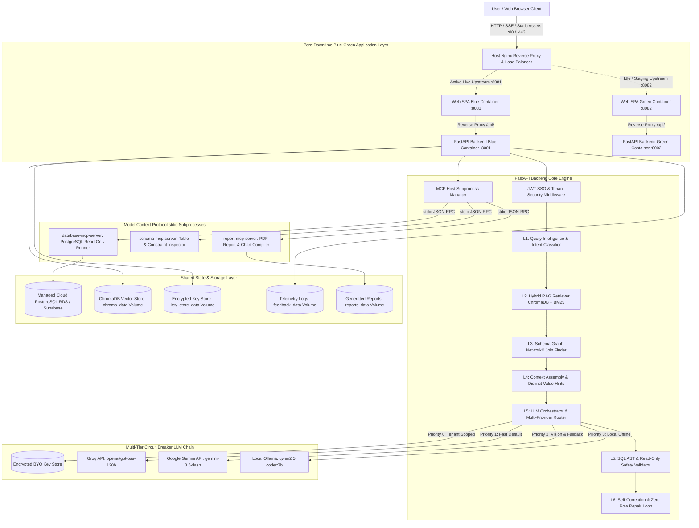
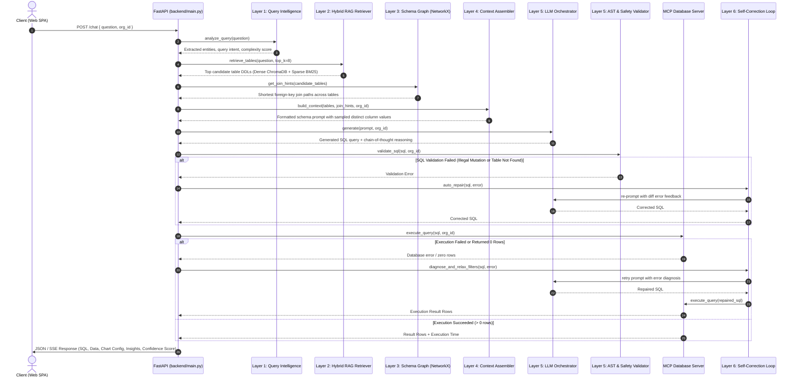
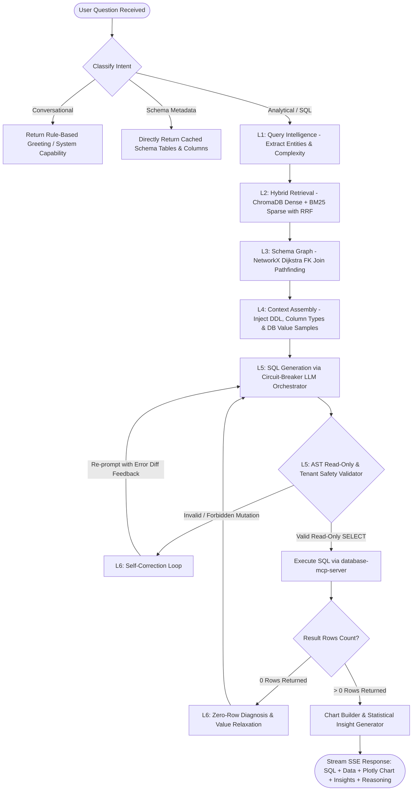
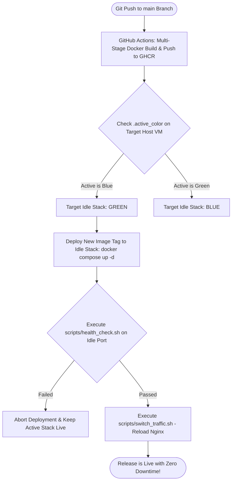
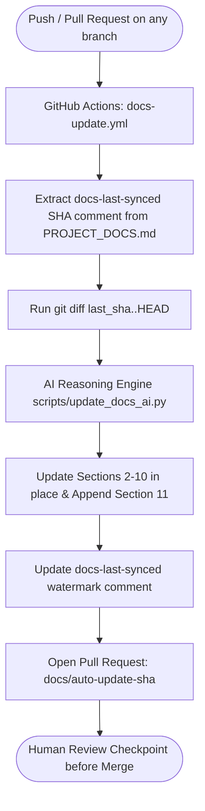

<!-- docs-last-synced: df1cf8c036d12799c5e34089a049749242608d2c -->
# chatbot_v2 — Comprehensive Technical Documentation & Architecture Reference

> **Natural-Language → Validated SQL → Interactive Visualizations → Statistical Insights**  
> Enterprise-grade conversational database assistant powered by a 6-layer Hybrid RAG pipeline, circuit-breaker multi-LLM orchestration, Model Context Protocol (MCP) subprocesses, PostgreSQL Row-Level Security (RLS), and zero-downtime Blue-Green production deployment.

---

## 1. Overview & Problem Statement

### 1.1 Executive Summary
**Antigravity DB (`chatbot_v2`)** is an enterprise AI analytics platform that bridges the gap between non-technical domain experts and complex relational databases. Traditional business intelligence tools require specialized SQL authoring knowledge or rigid dashboard templates. `chatbot_v2` enables users to query their database in natural, colloquial English (or via uploaded dashboard screenshots), automatically translating requests into syntax-validated, read-only PostgreSQL queries. Results are executed and returned within milliseconds, paired with auto-selected interactive Plotly charts, statistical anomaly insights, downloadable PDF reports, and real-time streaming reasoning explanations.

### 1.2 Core Value Propositions
- **Eliminate SQL Bottlenecks:** Business analysts and decision-makers obtain instant answers without waiting for database engineers.
- **Deterministic Accuracy (6-Layer Pipeline):** Overcomes common LLM hallucination issues (invented column names, wrong table joins, type mismatches) via dense+sparse hybrid retrieval, foreign-key graph traversal, and database value sampling.
- **Multi-Tier Fault Tolerance:** Zero downtime during LLM provider rate limits or outages through circuit-breaker routing (`Tenant BYO Keys` -> `Groq` -> `Google Gemini` -> `Local Ollama`).
- **Enterprise Multi-Tenancy & Data Security:** AST SQL parsing guarantees read-only `SELECT` queries with enforced tenant isolation (`zecure_org_id`) and PostgreSQL Row-Level Security (RLS).
- **Zero-Downtime Blue-Green Deployment:** Production updates are deployed to an idle container stack, health-checked, and cut over atomically in sub-milliseconds via Host Nginx.

---

## 2. System Architecture & Infrastructure

### 2.1 Complete Architectural Topology Diagram



### 2.2 Detailed Component Analysis

#### 1. Host Nginx Reverse Proxy (`nginx/nginx.conf`)
- **Port Binding:** Listens on public ports `80` (HTTP) and `443` (HTTPS/TLS).
- **Dynamic Upstream Switching:** Includes `/etc/nginx/conf.d/upstream_active.conf` which dynamically points to either `127.0.0.1:8081` (Blue) or `127.0.0.1:8082` (Green).
- **SSE Streaming Optimization:** Configured with `proxy_buffering off;`, `proxy_cache off;`, and `proxy_read_timeout 300s;` so live token-by-token reasoning streams are delivered without buffering delays.
- **Health Check Endpoint:** Exposes `/nginx-health` returning HTTP 200 for external infrastructure monitors.

#### 2. React 19 Production Frontend (`web/`)
- **Framework & Tooling:** React 19, Vite 6, TailwindCSS, Zustand state management, Plotly.js (`react-plotly.js`), Lucide React.
- **Container Architecture:** Multi-stage build (`node:20-alpine` -> `nginx:1.27-alpine`). Uses `nginx.conf.template` with runtime environment variable substitution (`$BACKEND_UPSTREAM`) to proxy `/api/` requests internally to `backend:8000`.
- **Key Modules:**
  - `ThinkingStream.jsx`: Real-time accordion stream rendering LLM reasoning tokens via Server-Sent Events (SSE).
  - `ChartRenderer.jsx`: Interactive Plotly charts with responsive sizing, custom tooltips, and dynamic theme colors.
  - `DataTable.jsx`: Paginated, searchable, client-sortable data grid with CSV export.
  - `EditableSQL.jsx`: Syntax-highlighted SQL editor allowing users to review, edit, and manually re-execute generated queries.
  - `SchemaExplorer.jsx`: Interactive database catalog browser showing tables, column types, primary keys, and foreign keys.
  - `SettingsDrawer.jsx`: Tenant BYO key management modal with live provider validation.

#### 3. FastAPI Backend Core (`backend/`)
- **Runtime:** Python 3.11, FastAPI, Uvicorn asynchronous ASGI server.
- **Responsibilities:** Request routing, CORS validation, slowapi rate limiting, JWT token verification, query classification, accuracy pipeline orchestration, and MCP client management.
- **Health Check (`GET /health`):** Validates database pool connectivity, ChromaDB vector store readiness, and MCP subprocess health.

#### 4. Model Context Protocol (MCP) Subprocesses (`mcp_servers/`)
- **Architecture:** Managed by `MCPHost` in `backend/mcp_client.py` over stdio JSON-RPC.
- **Process Isolation:** Runs outside the main ASGI web loop, preventing long-running database queries or PDF rendering from blocking API workers.

---

## 3. The 6-Layer Accuracy & RAG Pipeline

The platform uses a deterministic 6-layer pipeline to guarantee query correctness before executing SQL against the database:



### Detailed Layer Breakdown:

#### Layer 1: Query Intelligence & Intent Classification (`backend/query_intelligence.py`)
- Classifies incoming queries into three primary categories:
  1. `analytical_sql`: Requires database query generation, aggregation, and visualization.
  2. `schema_metadata`: Inquiries about database schema, tables, or column descriptions (bypasses LLM to query schema cache directly).
  3. `conversational`: Greetings, system capability questions, or help prompts.
- Extracts named entities, filters, date ranges, and estimates query complexity (low, medium, high).

#### Layer 2: Hybrid RAG Retrieval (`backend/hybrid_retriever.py`)
- Combines two complementary search algorithms:
  - **Dense Semantic Retrieval:** Embeds the user question using SentenceTransformers (`all-MiniLM-L6-v2`) and performs cosine similarity search against ChromaDB table descriptions.
  - **Sparse Keyword Retrieval:** Computes BM25 score against tokenized table DDLs, column names, and comments.
- **Reciprocal Rank Fusion (RRF):** Fuses dense and sparse rankings using Reciprocal Rank Fusion ($k=60$).
- Selects the top $K=8$ candidate tables, preventing prompt bloat and context truncation.

#### Layer 3: Schema Graph & Foreign Key Pathfinding (`backend/schema_graph.py`)
- Builds an in-memory directed graph of the database schema using **NetworkX**.
- Nodes represent tables; edges represent explicit foreign-key constraints and inferred primary-key relationships.
- When multiple candidate tables are retrieved, computes the **shortest join path** (Dijkstra's algorithm) to guarantee correct `JOIN ... ON` clauses without hallucinated relationship keys.

#### Layer 4: Context Assembly & Value Sampling (`backend/hybrid_retriever.py`)
- Injects live database column value hints into the prompt (e.g. valid enum values, active status strings, customer tiers) sampled from `distinct_column_values.json`.
- Formats complete table DDLs, column constraints, primary keys, and dynamic few-shot SQL examples.

#### Layer 5: LLM Orchestration & AST Validation (`backend/llm_orchestrator.py`, `backend/sql_validator.py`)
- Dispatches prompt to the active LLM provider through the multi-tier circuit breaker.
- **SQL AST Validation:** Parses generated SQL with regular expressions and AST tokenizers:
  - Enforces read-only `SELECT` statements (strictly rejects `INSERT`, `UPDATE`, `DELETE`, `DROP`, `ALTER`, `TRUNCATE`, `GRANT`).
  - Verifies table and column existence against database metadata catalog.
  - Enforces tenant filtering (`WHERE org_id = ...`).

#### Layer 6: Self-Correction & Zero-Row Diagnosis Loop (`backend/self_correction.py`)
- **Error Feedback Auto-Repair:** If PostgreSQL returns a syntax or execution error (e.g., column type mismatch in `GROUP BY`), the error message, failing SQL, and schema context are fed back to the LLM for automated repair (up to 2 retries).
- **Zero-Row Diagnosis:** If a query executes successfully but yields 0 rows, diagnoses potential cause (case-sensitive filter mismatch, overly restrictive date window) and suggests relaxed query alternatives.

---

## 4. Multi-Provider Circuit Breaker & Failover Architecture

The system implements an enterprise-grade, request-scoped circuit breaker across all supported LLM providers:

```
Tenant BYO Key Store (Priority 0)
         │ (If tenant supplied valid API key)
         ▼
Groq Cloud API (Priority 1 — Default Primary)
  Model: openai/gpt-oss-120b
  Characteristics: Sub-second latency, high SQL accuracy, cost-efficient
         │ (If rate limited / 5xx error / circuit OPEN)
         ▼
Google Gemini API (Priority 2 — Fallback 1 & Vision Agent)
  Model: gemini-3.6-flash
  Characteristics: Multimodal image reasoning, large context window
         │ (If network error / circuit OPEN)
         ▼
Local Ollama Daemon (Priority 3 — Fallback 2 / Air-Gapped)
  Model: qwen2.5-coder:7b (OLLAMA_NUM_CTX=8192)
  Characteristics: Runs on local GPU/CPU, zero external network dependencies
```

### Circuit Breaker State Transitions:
- **CLOSED (Normal Operation):** All requests pass through. Failures increment error counter.
- **OPEN (Trip Triggered):** 3 consecutive failures within 60 seconds trip the breaker. Immediate failover to the next provider occurs without attempting the failing endpoint.
- **HALF-OPEN (Auto-Recovery):** After a 60-second cooldown period, a single probe request is permitted. If successful, the breaker resets to `CLOSED`; if it fails, it returns to `OPEN` for another cooldown cycle.
- **Failure Telemetry:** Every provider error is appended with timestamps and stack traces to `data/llm_failures.jsonl`.

---

## 5. Visualizations, Insights & Data Flow Pipelines

### 5.1 End-to-End Query Execution Pipeline Diagram



### 5.2 Schema Embedding & Introspection ETL Pipeline

```mermaid
flowchart LR
    PostgresDB[(PostgreSQL Catalog)] -->|Introspect Tables & Columns| Introspect[schema_introspect.py]
    Introspect -->|Extract PK, FK, Comments, Enums| Enricher[Enriched Schema Builder]
    Enricher -->|Normalize Chunk Sizes| Chunker[Schema Chunk Normalizer]
    Chunker -->|Dense Vector Encoding| MiniLM[SentenceTransformers all-MiniLM-L6-v2]
    MiniLM -->|Store Embeddings & Metadata Payload| ChromaDB[(ChromaDB Vector Store)]
```



### 5.3 Blue-Green Production CI/CD Pipeline Flow



### 5.4 Living Documentation Automation Flow



### 5.5 Deterministic Chart Selection Rules (`backend/chart_builder.py`)

| Data Characteristics | Selected Chart Type | Plotly Template & Formatting |
| :--- | :--- | :--- |
| Single numerical metric over sequential date/time | **Line Chart** | `plotly.graph_objects.Scatter(mode='lines+markers')` with smooth interpolation |
| Categorical grouping with <= 8 discrete categories | **Bar Chart** / **Donut Chart** | Vertical bars with value data labels or circular donut with percentages |
| Categorical grouping with > 8 categories | **Horizontal Bar Chart** | Sorted in descending order for readability |
| Cumulative or multi-series time comparison | **Stacked Area Chart** | Filled area under curve with semi-transparent alpha |
| Multi-dimensional categorical comparison | **Grouped Bar Chart** | Clustered bars grouped by primary category |
| Distribution / Frequency data | **Histogram** | Binned numerical distribution |
| Two numerical variables correlation | **Scatter Plot** | X/Y coordinate markers with trendline |

### 5.2 Confidence Score Formula (`backend/confidence.py`)

The platform calculates a composite confidence score (0% - 100%) for every generated SQL query:

$$\text{Confidence Score} = w_1 \cdot S_{\text{retrieval}} + w_2 \cdot S_{\text{graph}} + w_3 \cdot S_{\text{ast}} + w_4 \cdot S_{\text{execution}} - P_{\text{retries}}$$

Where:
- $S_{\text{retrieval}}$ (30%): Average similarity score of top retrieved tables from ChromaDB.
- $S_{\text{graph}}$ (20%): Join path validity (1.0 if explicit FK join path found, 0.7 if inferred PK join).
- $S_{\text{ast}}$ (25%): AST validation score (1.0 if all columns match schema catalog exactly).
- $S_{\text{execution}}$ (25%): Execution health (1.0 for non-empty results, 0.5 for valid query returning 0 rows).
- $P_{\text{retries}}$: Penalty deduction of 10% per self-correction retry iteration.

---

## 6. Model Context Protocol (MCP) Server Specifications

The backend operates three dedicated subprocess servers adhering to the open **Model Context Protocol (MCP)** standard via stdio JSON-RPC:

### 6.1 `database-mcp-server` (`mcp_servers/database_server.py`)
- **`run_query(sql: str, org_id: str, max_rows: int = 500, page: int = 1)`**: Executes read-only SQL queries with parameterization, pagination, timeout enforcement (15s limit), and tenant security injection.
- **`list_tables()`**: Returns list of all user-accessible database tables.
- **`get_table_schema(table_name: str)`**: Returns detailed column names, data types, nullability, and primary key indicators.

### 6.2 `schema-mcp-server` (`mcp_servers/schema_server.py`)
- **`search_tables(query: str)`**: Performs regex and keyword search across table and column descriptions.
- **`get_relations(table_name: str)`**: Returns all incoming and outgoing foreign-key relationships for a specified table.
- **`get_distinct_values(table: str, column: str, limit: int = 25)`**: Retrieves sampled distinct database values for filter validation.

### 6.3 `report-mcp-server` (`mcp_servers/report_server.py`)
- **`generate_pdf(title: str, sections: list, charts: list, author: str)`**: Compiles query data, Plotly chart figures, and summary insights into a downloadable executive PDF report.
- **`export_csv(data: list, filename: str)`**: Formats database row sets into structured CSV documents.

---

## 7. Complete API Reference

| Method | Endpoint | Description | Request Body / Parameters | Response Schema |
| :--- | :--- | :--- | :--- | :--- |
| `POST` | `/chat` | Standard synchronous NL-to-SQL query | `{"question": str, "org_id": str, "model": str}` | `{"sql": str, "data": list, "chart": dict, "insights": list, "confidence": float}` |
| `POST` | `/chat/stream` | Server-Sent Events (SSE) streaming query | `{"question": str, "org_id": str}` | Event stream (`step`, `token`, `result`, `error`) |
| `GET` | `/health` | System health check | None | `{"status": "healthy", "database": "connected", "embeddings": "ready"}` |
| `GET` | `/schema/tables` | List all database tables | None | `{"tables": [{"name": str, "columns": int, "rows": int}]}` |
| `GET` | `/schema/table/{name}` | Detailed table schema | Path parameter `name` | `{"columns": [...], "primary_keys": [...], "foreign_keys": [...]}` |
| `GET` | `/settings/providers` | LLM provider catalog & active keys | None | `{"providers": [{"id": str, "name": str, "models": list, "active": bool}]}` |
| `POST` | `/settings/keys/validate` | Test API key against provider | `{"provider": str, "api_key": str}` | `{"valid": bool, "message": str}` |
| `POST` | `/settings/keys/save` | Save encrypted tenant API key | `{"org_id": str, "provider": str, "api_key": str}` | `{"status": "saved"}` |
| `POST` | `/feedback` | Submit user thumbs up/down rating | `{"query_id": str, "rating": int, "comment": str}` | `{"status": "logged"}` |
| `POST` | `/admin/reindex` | Trigger schema embedding re-sync | Header: `X-Admin-Key: <key>` | `{"status": "reindexed", "indexed_tables": int}` |

---

## 8. File-by-File Reference (Current State)

### 8.1 Root Directory Files

| File | Purpose | Key Functions / Exports | Architecture Role |
| :--- | :--- | :--- | :--- |
| [`.env`](file:///c:/Users/kisho/OneDrive/Desktop/chatbot_v2/.env) | Local environment variable definitions | Database URI, Groq & Gemini API keys | Git-ignored local configuration |
| [`.env.blue`](file:///c:/Users/kisho/OneDrive/Desktop/chatbot_v2/.env.blue) | Blue environment production settings | Ports `8081`/`8001`, Cloud DB connection | Blue stack container environment |
| [`.env.green`](file:///c:/Users/kisho/OneDrive/Desktop/chatbot_v2/.env.green) | Green environment production settings | Ports `8082`/`8002`, Cloud DB connection | Green stack container environment |
| [`.env.example`](file:///c:/Users/kisho/OneDrive/Desktop/chatbot_v2/.env.example) | Example environment file for local dev | Reference keys and default values | Developer setup reference |
| [`.env.production.example`](file:///c:/Users/kisho/OneDrive/Desktop/chatbot_v2/.env.production.example) | Example environment file for cloud deployment | Cloud RDS connection format & auth keys | Production setup reference |
| [`.env.save`](file:///c:/Users/kisho/OneDrive/Desktop/chatbot_v2/.env.save) | Configuration snapshot backup | Historical snapshot of environment | Backup reference |
| [`.gitignore`](file:///c:/Users/kisho/OneDrive/Desktop/chatbot_v2/.gitignore) | Git exclusion patterns | Excludes `.venv`, `node_modules`, `.env`, build artifacts | Source control cleanliness |
| [`DEPLOYMENT.md`](file:///c:/Users/kisho/OneDrive/Desktop/chatbot_v2/DEPLOYMENT.md) | Operations & Deployment Manual | Blue-Green guide, Cloud DB migration steps | Operational manual |
| [`PROJECT_DOCS.md`](file:///c:/Users/kisho/OneDrive/Desktop/chatbot_v2/PROJECT_DOCS.md) | Master living project documentation | System architecture, RAG pipelines, complete file index | Single source of truth |
| [`README.md`](file:///c:/Users/kisho/OneDrive/Desktop/chatbot_v2/README.md) | Project quickstart & overview guide | High-level summary, local dev, Docker commands | Developer landing page |
| [`SETUP_GUIDE.md`](file:///c:/Users/kisho/OneDrive/Desktop/chatbot_v2/SETUP_GUIDE.md) | Developer onboarding guide | Environment setup, database migrations | Onboarding documentation |
| [`diagnose_llm.py`](file:///c:/Users/kisho/OneDrive/Desktop/chatbot_v2/diagnose_llm.py) | Standalone LLM diagnostic test suite | `test_groq()`, `test_gemini()`, `test_ollama()` | Pre-deployment verification |
| [`docker-compose.yml`](file:///c:/Users/kisho/OneDrive/Desktop/chatbot_v2/docker-compose.yml) | Local multi-container development compose | Services: `backend` (:8000), `web` (:8080) | Local dev orchestration |
| [`docker-compose.blue.yml`](file:///c:/Users/kisho/OneDrive/Desktop/chatbot_v2/docker-compose.blue.yml) | Production Blue container stack definition | Services: `backend-blue` (:8001), `web-blue` (:8081) | Blue production deployment |
| [`docker-compose.green.yml`](file:///c:/Users/kisho/OneDrive/Desktop/chatbot_v2/docker-compose.green.yml) | Production Green container stack definition | Services: `backend-green` (:8002), `web-green` (:8082) | Green production deployment |
| [`requirements.txt`](file:///c:/Users/kisho/OneDrive/Desktop/chatbot_v2/requirements.txt) | Python dependencies manifest | FastAPI, PyJWT, ChromaDB, SentenceTransformers | Production Python dependencies |
| [`hackathon_presentation_guide.md`](file:///c:/Users/kisho/OneDrive/Desktop/chatbot_v2/hackathon_presentation_guide.md) | Feature demonstration script & talking points | Live demo prompts, RAG talking points | Presentation reference |
| [`all_lookup_tables.json`](file:///c:/Users/kisho/OneDrive/Desktop/chatbot_v2/all_lookup_tables.json) | Catalog of detected reference/lookup tables | Table metadata definitions | Introspection cache |
| [`candidates_raw.json`](file:///c:/Users/kisho/OneDrive/Desktop/chatbot_v2/candidates_raw.json) | Raw candidate table definitions | Table introspection candidate list | Introspection cache |
| [`classified_buckets.json`](file:///c:/Users/kisho/OneDrive/Desktop/chatbot_v2/classified_buckets.json) | Domain classification buckets | Domain categorized tables | Query classification cache |
| [`distinct_column_values.json`](file:///c:/Users/kisho/OneDrive/Desktop/chatbot_v2/distinct_column_values.json) | Sampled database column value dictionary | Filter value lookup samples | L4 Context injection cache |
| [`enum_search_results.json`](file:///c:/Users/kisho/OneDrive/Desktop/chatbot_v2/enum_search_results.json) | Detected PostgreSQL enum types & values | Enum values mapped per column | Query intelligence dictionary |
| [`feedback_log.jsonl`](file:///c:/Users/kisho/OneDrive/Desktop/chatbot_v2/feedback_log.jsonl) | User thumbs up/down feedback log | JSONL feedback records | RLHF / fine-tuning data |
| [`final_search_report.json`](file:///c:/Users/kisho/OneDrive/Desktop/chatbot_v2/final_search_report.json) | Comprehensive schema introspection audit | Detailed schema relationship audit | Reference schema audit |
| [`lookup_audit_results.json`](file:///c:/Users/kisho/OneDrive/Desktop/chatbot_v2/lookup_audit_results.json) | Verification results of lookup relationships | Foreign key audit records | Verification cache |
| [`lookup_tables_data.json`](file:///c:/Users/kisho/OneDrive/Desktop/chatbot_v2/lookup_tables_data.json) | Seed data records for lookup tables | Reference values for lookup tables | Reference data |
| [`technical_status_report.pdf`](file:///c:/Users/kisho/OneDrive/Desktop/chatbot_v2/technical_status_report.pdf) | Compiled PDF documentation export | Technical project overview | Document export |
| [`user_79_list.json`](file:///c:/Users/kisho/OneDrive/Desktop/chatbot_v2/user_79_list.json) | Test fixture records for tenant validation | Sample tenant user dataset | Test fixture |

---

### 8.2 `backend/` Module Files

| File | Purpose | Key Functions / Exports | Architecture Role |
| :--- | :--- | :--- | :--- |
| [`backend/Dockerfile`](file:///c:/Users/kisho/OneDrive/Desktop/chatbot_v2/backend/Dockerfile) | Production container build definition | Debian Python 3.11 image, Healthcheck | Exposes port 8000 |
| [`backend/__init__.py`](file:///c:/Users/kisho/OneDrive/Desktop/chatbot_v2/backend/__init__.py) | Package initialization marker | Empty package marker | Standard Python init |
| [`backend/auth.py`](file:///c:/Users/kisho/OneDrive/Desktop/chatbot_v2/backend/auth.py) | JWT authentication & SSO verification | `get_current_user()`, `AuthenticatedUser` | Verifies JWKS tokens |
| [`backend/chart_builder.py`](file:///c:/Users/kisho/OneDrive/Desktop/chatbot_v2/backend/chart_builder.py) | Deterministic chart selection & Plotly JSON | `build_chart()`, `_choose_chart_type()` | Line, bar, donut, area |
| [`backend/confidence.py`](file:///c:/Users/kisho/OneDrive/Desktop/chatbot_v2/backend/confidence.py) | Query confidence scoring engine | `calculate_confidence()` | 0-100% confidence metric |
| [`backend/data_source.py`](file:///c:/Users/kisho/OneDrive/Desktop/chatbot_v2/backend/data_source.py) | Multi-source database connection manager | `get_db_connection()`, connection pooling | Handles local & cloud DBs |
| [`backend/hybrid_retriever.py`](file:///c:/Users/kisho/OneDrive/Desktop/chatbot_v2/backend/hybrid_retriever.py) | Dense + Sparse RRF schema retriever | `retrieve_tables()`, `build_value_hints()` | ChromaDB + BM25 |
| [`backend/insights.py`](file:///c:/Users/kisho/OneDrive/Desktop/chatbot_v2/backend/insights.py) | Statistical insight & follow-up generator | `compute_quick_stats()`, `generate_followups()` | Outliers, distributions |
| [`backend/llm_config.py`](file:///c:/Users/kisho/OneDrive/Desktop/chatbot_v2/backend/llm_config.py) | Live runtime configuration snapshotting | `RuntimeConfig`, `runtime_config.snapshot()` | Thread-safe reload on change |
| [`backend/llm_key_store.py`](file:///c:/Users/kisho/OneDrive/Desktop/chatbot_v2/backend/llm_key_store.py) | Encrypted tenant BYO key persistence | `save_key()`, `get_active_credentials()` | AES/SHA256 locked store |
| [`backend/llm_orchestrator.py`](file:///c:/Users/kisho/OneDrive/Desktop/chatbot_v2/backend/llm_orchestrator.py) | Multi-provider router & circuit breaker | `LLMOrchestrator.generate()`, `validate_key()` | Groq, Gemini, Ollama |
| [`backend/llm_registry.py`](file:///c:/Users/kisho/OneDrive/Desktop/chatbot_v2/backend/llm_registry.py) | Provider metadata catalog & active models | `PROVIDERS`, `provider_catalog()` | Single source of model names |
| [`backend/main.py`](file:///c:/Users/kisho/OneDrive/Desktop/chatbot_v2/backend/main.py) | FastAPI application entry point & routes | `chat()`, `chat_stream()`, `health()` | Lifespan, CORS, rate limits |
| [`backend/mcp_client.py`](file:///c:/Users/kisho/OneDrive/Desktop/chatbot_v2/backend/mcp_client.py) | Client Host for MCP stdio subprocesses | `MCPHost.start()`, `run_query()` | Wraps JSON-RPC calls |
| [`backend/model_router.py`](file:///c:/Users/kisho/OneDrive/Desktop/chatbot_v2/backend/model_router.py) | Compatibility facade for orchestrator | `ModelRouterFacade.generate()` | Legacy adapter |
| [`backend/prompts.py`](file:///c:/Users/kisho/OneDrive/Desktop/chatbot_v2/backend/prompts.py) | Chain-of-thought SQL system prompts | `get_system_prompt()`, SQL safety guidelines | Prompt engineering templates |
| [`backend/query_intelligence.py`](file:///c:/Users/kisho/OneDrive/Desktop/chatbot_v2/backend/query_intelligence.py) | L1 Query context & entity extractor | `build_query_context()`, `extract_entities()` | Complexity & table extraction |
| [`backend/query_intent.py`](file:///c:/Users/kisho/OneDrive/Desktop/chatbot_v2/backend/query_intent.py) | Query intent classifier | `detect_intent()`, `is_followup()` | Analytical vs Conversational |
| [`backend/schema_graph.py`](file:///c:/Users/kisho/OneDrive/Desktop/chatbot_v2/backend/schema_graph.py) | NetworkX FK graph for multi-table JOINs | `get_join_hints()`, `expand_related_tables()` | Computes shortest join paths |
| [`backend/self_correction.py`](file:///c:/Users/kisho/OneDrive/Desktop/chatbot_v2/backend/self_correction.py) | L6 Self-correction & zero-row diagnosis | `diagnose_zero_rows()`, `try_auto_repair()` | Automatic SQL retry loop |
| [`backend/sql_validator.py`](file:///c:/Users/kisho/OneDrive/Desktop/chatbot_v2/backend/sql_validator.py) | AST & regex read-only SQL validator | `extract_sql()`, `validate_sql()`, `validate_org_security()` | Enforces read-only SELECT |

---

### 8.3 `web/` Frontend Module Files

| File | Purpose | Key Functions / Exports | Architecture Role |
| :--- | :--- | :--- | :--- |
| [`web/Dockerfile`](file:///c:/Users/kisho/OneDrive/Desktop/chatbot_v2/web/Dockerfile) | Multi-stage production container build | Node 20 build -> Nginx 1.27 Alpine runtime | Port 80, envsubst proxy |
| [`web/index.html`](file:///c:/Users/kisho/OneDrive/Desktop/chatbot_v2/web/index.html) | HTML entry point | Root div, font imports | SPA entry point |
| [`web/nginx.conf.template`](file:///c:/Users/kisho/OneDrive/Desktop/chatbot_v2/web/nginx.conf.template) | Nginx template for dynamic upstream proxy | Reverse-proxies `/api/` to `$BACKEND_UPSTREAM` | SSE streaming unbuffered |
| [`web/package.json`](file:///c:/Users/kisho/OneDrive/Desktop/chatbot_v2/web/package.json) | Frontend dependencies & npm scripts | Scripts: `dev`, `build`, `preview` | React 19, Vite 6, Tailwind |
| [`web/package-lock.json`](file:///c:/Users/kisho/OneDrive/Desktop/chatbot_v2/web/package-lock.json) | Locked npm dependency tree | Deterministic dependency graph | Exact package versions |
| [`web/vite.config.js`](file:///c:/Users/kisho/OneDrive/Desktop/chatbot_v2/web/vite.config.js) | Vite configuration file | React plugin, dev proxy configuration | Build & dev server config |
| [`web/src/main.jsx`](file:///c:/Users/kisho/OneDrive/Desktop/chatbot_v2/web/src/main.jsx) | React application root mounting script | `ReactDOM.createRoot()` | Mounts `<App />` |
| [`web/src/App.jsx`](file:///c:/Users/kisho/OneDrive/Desktop/chatbot_v2/web/src/App.jsx) | Primary application container | Root component layout & store binding | Main App layout |
| [`web/src/index.css`](file:///c:/Users/kisho/OneDrive/Desktop/chatbot_v2/web/src/index.css) | Global TailwindCSS stylesheet | Utility classes, animations, scrollbars | Design styles |
| [`web/src/api/client.js`](file:///c:/Users/kisho/OneDrive/Desktop/chatbot_v2/web/src/api/client.js) | Base HTTP client with error handling | `apiFetch()`, base URL resolution | Common fetch wrapper |
| [`web/src/api/chat.js`](file:///c:/Users/kisho/OneDrive/Desktop/chatbot_v2/web/src/api/chat.js) | Chat and streaming API client | `sendChatMessage()`, `streamChatMessage()` | SSE & POST callers |
| [`web/src/api/dashboard.js`](file:///c:/Users/kisho/OneDrive/Desktop/chatbot_v2/web/src/api/dashboard.js) | Dashboard metrics and stats API | `getDashboardStats()` | Dashboard data caller |
| [`web/src/api/schema.js`](file:///c:/Users/kisho/OneDrive/Desktop/chatbot_v2/web/src/api/schema.js) | Schema exploration API client | `fetchSchemaTables()`, `fetchTableColumns()` | Schema Explorer backend caller |
| [`web/src/api/settings.js`](file:///c:/Users/kisho/OneDrive/Desktop/chatbot_v2/web/src/api/settings.js) | Tenant BYO key & model settings API | `getProviders()`, `validateKey()`, `saveKey()` | Settings drawer caller |
| [`web/src/stores/chatStore.js`](file:///c:/Users/kisho/OneDrive/Desktop/chatbot_v2/web/src/stores/chatStore.js) | Zustand global state management store | Messages, current query, active org, keys | Central state store |
| [`web/src/hooks/useChat.js`](file:///c:/Users/kisho/OneDrive/Desktop/chatbot_v2/web/src/hooks/useChat.js) | Custom React hook for chat interactions | `sendMessage()`, message history lifecycle | Message dispatch hook |
| [`web/src/hooks/useSchema.js`](file:///c:/Users/kisho/OneDrive/Desktop/chatbot_v2/web/src/hooks/useSchema.js) | Custom React hook for database schema | `tables`, `selectedTable`, `searchQuery` | Schema state hook |
| [`web/src/components/chat/ChatPanel.jsx`](file:///c:/Users/kisho/OneDrive/Desktop/chatbot_v2/web/src/components/chat/ChatPanel.jsx) | Main chat stream container | Renders message bubbles, auto-scroll | Primary chat viewport |
| [`web/src/components/chat/ChatInput.jsx`](file:///c:/Users/kisho/OneDrive/Desktop/chatbot_v2/web/src/components/chat/ChatInput.jsx) | User prompt input & image upload bar | Textarea, file upload, submit triggers | Chat prompt bar |
| [`web/src/components/chat/MessageBubble.jsx`](file:///c:/Users/kisho/OneDrive/Desktop/chatbot_v2/web/src/components/chat/MessageBubble.jsx) | Message bubble renderer | User vs AI message formatting | Bubble container |
| [`web/src/components/chat/ThinkingStream.jsx`](file:///c:/Users/kisho/OneDrive/Desktop/chatbot_v2/web/src/components/chat/ThinkingStream.jsx) | Real-time reasoning stream visualizer | Collapsible thinking steps & live tokens | Live SSE viewer |
| [`web/src/components/chat/TypingIndicator.jsx`](file:///c:/Users/kisho/OneDrive/Desktop/chatbot_v2/web/src/components/chat/TypingIndicator.jsx) | Animated loading dots indicator | Visual pulsing animation | Loading state |
| [`web/src/components/chat/HomeDashboard.jsx`](file:///c:/Users/kisho/OneDrive/Desktop/chatbot_v2/web/src/components/chat/HomeDashboard.jsx) | Default empty-state welcome dashboard | Suggested starter queries, stat summary | Initial landing screen |
| [`web/src/components/results/SQLResultCard.jsx`](file:///c:/Users/kisho/OneDrive/Desktop/chatbot_v2/web/src/components/results/SQLResultCard.jsx) | Container card for query results | Combines SQL, Table, Chart, Insights | Main response card |
| [`web/src/components/results/ChartRenderer.jsx`](file:///c:/Users/kisho/OneDrive/Desktop/chatbot_v2/web/src/components/results/ChartRenderer.jsx) | Plotly interactive chart component | Renders dynamic Plotly graph layouts | Interactive charts |
| [`web/src/components/results/DataTable.jsx`](file:///c:/Users/kisho/OneDrive/Desktop/chatbot_v2/web/src/components/results/DataTable.jsx) | Paginated data grid with sorting | Searchable data table, CSV export | Result data table |
| [`web/src/components/results/EditableSQL.jsx`](file:///c:/Users/kisho/OneDrive/Desktop/chatbot_v2/web/src/components/results/EditableSQL.jsx) | Syntax-highlighted in-place SQL editor | Allows manual editing & re-execution | Direct SQL editor |
| [`web/src/components/results/InsightChips.jsx`](file:///c:/Users/kisho/OneDrive/Desktop/chatbot_v2/web/src/components/results/InsightChips.jsx) | Statistical insight badges | Outlier & trend callouts | Metric summary chips |
| [`web/src/components/results/FollowUpButtons.jsx`](file:///c:/Users/kisho/OneDrive/Desktop/chatbot_v2/web/src/components/results/FollowUpButtons.jsx) | Recommended query follow-up pills | Click-to-ask follow-up questions | Follow-up prompts |
| [`web/src/components/results/FeedbackButtons.jsx`](file:///c:/Users/kisho/OneDrive/Desktop/chatbot_v2/web/src/components/results/FeedbackButtons.jsx) | Thumbs up / thumbs down feedback controls | Logs feedback to `/feedback` | User rating controls |
| [`web/src/components/results/AnimatedStat.jsx`](file:///c:/Users/kisho/OneDrive/Desktop/chatbot_v2/web/src/components/results/AnimatedStat.jsx) | Animated numerical counter for single stats | Smooth count-up transition | KPI card widget |
| [`web/src/components/schema/SchemaExplorer.jsx`](file:///c:/Users/kisho/OneDrive/Desktop/chatbot_v2/web/src/components/schema/SchemaExplorer.jsx) | Interactive database schema navigation drawer | Searchable tables, column types, FKs | Schema browser |
| [`web/src/components/settings/SettingsDrawer.jsx`](file:///c:/Users/kisho/OneDrive/Desktop/chatbot_v2/web/src/components/settings/SettingsDrawer.jsx) | Tenant BYO key management modal | Add, test, save, and toggle API keys | Settings modal |
| [`web/src/components/settings/APIKeyCard.jsx`](file:///c:/Users/kisho/OneDrive/Desktop/chatbot_v2/web/src/components/settings/APIKeyCard.jsx) | Card widget for configured API key | Shows masked key, provider status, toggle | Key status card |
| [`web/src/components/layout/AppShell.jsx`](file:///c:/Users/kisho/OneDrive/Desktop/chatbot_v2/web/src/components/layout/AppShell.jsx) | Main responsive application layout shell | Combines TopNav, Sidebar, RightSidebar | App layout container |
| [`web/src/components/layout/TopNav.jsx`](file:///c:/Users/kisho/OneDrive/Desktop/chatbot_v2/web/src/components/layout/TopNav.jsx) | Header bar with org switcher & active status | Org selector, active model badge | Top navigation bar |
| [`web/src/components/layout/Sidebar.jsx`](file:///c:/Users/kisho/OneDrive/Desktop/chatbot_v2/web/src/components/layout/Sidebar.jsx) | Left sidebar with conversation history | New chat button, query history items | Navigation sidebar |
| [`web/src/components/layout/RightSidebar.jsx`](file:///c:/Users/kisho/OneDrive/Desktop/chatbot_v2/web/src/components/layout/RightSidebar.jsx) | Right sidebar with schema explorer toggle | Quick access to database schema & tables | Right drawer toggle |
| [`web/src/components/layout/StatusBar.jsx`](file:///c:/Users/kisho/OneDrive/Desktop/chatbot_v2/web/src/components/layout/StatusBar.jsx) | Footer status bar showing system health | Latency, database connection state | System status bar |
| [`web/src/components/layout/ToastStack.jsx`](file:///c:/Users/kisho/OneDrive/Desktop/chatbot_v2/web/src/components/layout/ToastStack.jsx) | Global toast notification container | Dispatches success/error notifications | Toast notification stack |
| [`web/src/components/layout/NotificationCenter.jsx`](file:///c:/Users/kisho/OneDrive/Desktop/chatbot_v2/web/src/components/layout/NotificationCenter.jsx) | Notification bell drawer | Activity alerts & system notices | Alert center |
| [`web/src/components/layout/OrgLogin.jsx`](file:///c:/Users/kisho/OneDrive/Desktop/chatbot_v2/web/src/components/layout/OrgLogin.jsx) | Organization login / selection modal | Sets active `org_id` context | Organization switcher |
| [`web/src/components/common/CopyButton.jsx`](file:///c:/Users/kisho/OneDrive/Desktop/chatbot_v2/web/src/components/common/CopyButton.jsx) | Reusable clipboard copy button | Copies text with visual checkmark feedback | Copy to clipboard utility |
| [`web/src/utils/constants.js`](file:///c:/Users/kisho/OneDrive/Desktop/chatbot_v2/web/src/utils/constants.js) | Global frontend constants | API route definitions, theme colors | Constants definition |
| [`web/src/utils/formatters.js`](file:///c:/Users/kisho/OneDrive/Desktop/chatbot_v2/web/src/utils/formatters.js) | Data formatting utility functions | Numbers, currencies, dates, SQL strings | Formatting utilities |
| [`web/src/utils/sseParser.js`](file:///c:/Users/kisho/OneDrive/Desktop/chatbot_v2/web/src/utils/sseParser.js) | Server-Sent Events stream parser | Parses chunked SSE event streams | SSE stream reader |

---

### 8.4 Other Directories (`mcp_servers/`, `embeddings/`, `nginx/`, `scripts/`, `deploy/`, `migrations/`, `data/`, `frontend/`)

| File | Purpose | Key Functions / Exports | Architecture Role |
| :--- | :--- | :--- | :--- |
| [`mcp_servers/database_server.py`](file:///c:/Users/kisho/OneDrive/Desktop/chatbot_v2/mcp_servers/database_server.py) | Database MCP server subprocess | `run_query()`, `get_schema()`, `list_tables()` | Read-only SQL executor |
| [`mcp_servers/schema_server.py`](file:///c:/Users/kisho/OneDrive/Desktop/chatbot_v2/mcp_servers/schema_server.py) | Schema MCP server subprocess | `search_tables()`, `get_columns()`, `get_relations()` | Table structure inspector |
| [`mcp_servers/report_server.py`](file:///c:/Users/kisho/OneDrive/Desktop/chatbot_v2/mcp_servers/report_server.py) | Reporting MCP server subprocess | `generate_pdf()`, `make_chart()`, `export_csv()` | PDF & CSV generator |
| [`embeddings/schema_introspect.py`](file:///c:/Users/kisho/OneDrive/Desktop/chatbot_v2/embeddings/schema_introspect.py) | Introspects DB schema and builds text chunks | `introspect_all()`, `_chunk_description()` | Chunked schema reflection |
| [`embeddings/build_index.py`](file:///c:/Users/kisho/OneDrive/Desktop/chatbot_v2/embeddings/build_index.py) | Vector index generation script | `build_index()`, SentenceTransformers encoder | Populates ChromaDB store |
| [`embeddings/retrieve.py`](file:///c:/Users/kisho/OneDrive/Desktop/chatbot_v2/embeddings/retrieve.py) | Vector retrieval query interface | `query_similar_tables()`, `is_index_ready()` | ChromaDB search wrapper |
| [`nginx/nginx.conf`](file:///c:/Users/kisho/OneDrive/Desktop/chatbot_v2/nginx/nginx.conf) | Host Nginx reverse proxy configuration | Routes public traffic to `chatbot_app` upstream | Unbuffered SSE proxy |
| [`nginx/upstream_blue.conf`](file:///c:/Users/kisho/OneDrive/Desktop/chatbot_v2/nginx/upstream_blue.conf) | Upstream configuration targeting Blue stack | Upstream pointing to 127.0.0.1:8081 | Active Blue upstream |
| [`nginx/upstream_green.conf`](file:///c:/Users/kisho/OneDrive/Desktop/chatbot_v2/nginx/upstream_green.conf) | Upstream configuration targeting Green stack | Upstream pointing to 127.0.0.1:8082 | Active Green upstream |
| [`scripts/switch_traffic.sh`](file:///c:/Users/kisho/OneDrive/Desktop/chatbot_v2/scripts/switch_traffic.sh) | Zero-downtime traffic cutover & rollback script | Copies upstream config & runs `nginx -s reload` | Atomic traffic cutover |
| [`scripts/health_check.sh`](file:///c:/Users/kisho/OneDrive/Desktop/chatbot_v2/scripts/health_check.sh) | Smoke test runner for target deployment stack | Tests `/health`, `/`, and `/settings/providers` | Pre-cutover validator |
| [`scripts/update_docs_ai.py`](file:///c:/Users/kisho/OneDrive/Desktop/chatbot_v2/scripts/update_docs_ai.py) | AI-powered living documentation updater | Analyzes git diffs, re-syncs PROJECT_DOCS.md | Living docs sync |
| [`scripts/generate_docs_pdf.py`](file:///c:/Users/kisho/OneDrive/Desktop/chatbot_v2/scripts/generate_docs_pdf.py) | High-precision PDF documentation compiler | Renders HTML5+CSS/PDF with Edge/Chrome | PDF document compiler |
| [`deploy/ecs-task-definition.json`](file:///c:/Users/kisho/OneDrive/Desktop/chatbot_v2/deploy/ecs-task-definition.json) | Legacy AWS ECS task definition template | Container definitions for backend & EFS mount | AWS ECS deployment |
| [`deploy/terraform/main.tf`](file:///c:/Users/kisho/OneDrive/Desktop/chatbot_v2/deploy/terraform/main.tf) | Legacy Terraform AWS infrastructure template | ECS cluster, EFS, ALB, IAM roles | AWS Terraform config |
| [`deploy/terraform/variables.tf`](file:///c:/Users/kisho/OneDrive/Desktop/chatbot_v2/deploy/terraform/variables.tf) | Terraform input variable definitions | VPC, subnet, secret ARN variables | Terraform input specs |
| [`deploy/terraform/outputs.tf`](file:///c:/Users/kisho/OneDrive/Desktop/chatbot_v2/deploy/terraform/outputs.tf) | Terraform output attributes | ECR repo URL, ALB DNS name | Terraform outputs |
| [`deploy/terraform/frontend.tf`](file:///c:/Users/kisho/OneDrive/Desktop/chatbot_v2/deploy/terraform/frontend.tf) | Terraform S3 & CloudFront distribution template | S3 bucket, CloudFront CDN config | Static frontend infra |
| [`migrations/001_enable_rls.sql`](file:///c:/Users/kisho/OneDrive/Desktop/chatbot_v2/migrations/001_enable_rls.sql) | Database migration for Row-Level Security | `ALTER TABLE ... ENABLE ROW LEVEL SECURITY` | PostgreSQL RLS script |
| [`data/llm_keys.json`](file:///c:/Users/kisho/OneDrive/Desktop/chatbot_v2/data/llm_keys.json) | Encrypted tenant BYO key persistence store | AES-encrypted API keys scoped by tenant ID | Tenant credential store |
| [`data/llm_failures.jsonl`](file:///c:/Users/kisho/OneDrive/Desktop/chatbot_v2/data/llm_failures.jsonl) | Persistent audit log of LLM provider failures | Detailed error type, HTTP status, timestamp | Reliability telemetry |
| [`frontend/app.py`](file:///c:/Users/kisho/OneDrive/Desktop/chatbot_v2/frontend/app.py) | Legacy Streamlit UI main application | Streamlit prototype chat interface | Alternative UI |
| [`frontend/pages/2_Settings.py`](file:///c:/Users/kisho/OneDrive/Desktop/chatbot_v2/frontend/pages/2_Settings.py) | Legacy Streamlit UI settings page | Streamlit API key management | Alternative UI settings |
| [`.github/workflows/deploy.yml`](file:///c:/Users/kisho/OneDrive/Desktop/chatbot_v2/.github/workflows/deploy.yml) | Production Blue-Green CI/CD workflow | Build multi-arch image, deploy idle, cutover | GitHub Actions CI/CD |
| [`.github/workflows/docs-update.yml`](file:///c:/Users/kisho/OneDrive/Desktop/chatbot_v2/.github/workflows/docs-update.yml) | Living documentation auto-update workflow | Computes diff, triggers AI reasoning, opens PR | Living docs automation |

---

## 9. Deployment, Migration & Operations Manual

### 9.1 Managed Cloud Database Migration (pgAdmin -> Cloud PostgreSQL)
To migrate local development databases to AWS RDS, Supabase, or DigitalOcean Managed PostgreSQL:

```bash
# 1. Dump local PostgreSQL database
pg_dump -U postgres -h localhost -p 5432 -d intern_db -F c -b -v -f intern_db_backup.dump

# 2. Restore into managed cloud instance
pg_restore -U <cloud_user> -h <cloud_db_host> -p 5432 -d <cloud_dbname> -v intern_db_backup.dump

# 3. Configure connection string with SSL in .env.blue and .env.green
DATABASE_URL=postgresql://<cloud_user>:<cloud_password>@<cloud_db_host>:5432/<cloud_dbname>?sslmode=require

# 4. Rebuild embedding index against live cloud schema
python -m embeddings.build_index --full
```

### 9.2 Zero-Downtime Blue-Green Release Procedure

```bash
# Step 1: Query currently active stack
cat .active_color   # e.g. "blue"

# Step 2: Build and deploy update to the idle stack (green)
docker compose -f docker-compose.green.yml up -d --build

# Step 3: Execute automated smoke tests on idle port
./scripts/health_check.sh green

# Step 4: Perform atomic zero-downtime traffic cutover
./scripts/switch_traffic.sh green
```

### 9.3 Instant Zero-Downtime Rollback

If an unexpected issue occurs on the newly active Green stack, roll back instantly:
```bash
./scripts/switch_traffic.sh blue
```
Traffic is restored to Blue in < 1ms with zero dropped connections.

---

## 10. Environment Variables Dictionary

| Variable Name | Type | Required | Default Value | Description |
| :--- | :---: | :---: | :--- | :--- |
| `DATABASE_URL` | String | **Yes** | `postgresql://...` | PostgreSQL connection URI |
| `PRIMARY_LLM` | String | No | `groq` | Default provider priority (`groq`, `gemini`, `qwen`) |
| `GROQ_API_KEY` | Secret | No | None | API authentication key for Groq Cloud |
| `GROQ_MODEL` | String | No | `openai/gpt-oss-120b` | Groq model identifier |
| `GEMINI_API_KEY` | Secret | No | None | API authentication key for Google Gemini |
| `GEMINI_MODEL` | String | No | `gemini-3.6-flash` | Gemini model identifier |
| `OLLAMA_BASE_URL` | String | No | `http://localhost:11434` | HTTP base URL for local/remote Ollama daemon |
| `OLLAMA_MODEL` | String | No | `qwen2.5-coder:7b` | Ollama model identifier |
| `OLLAMA_NUM_CTX` | Integer| No | `8192` | Token context budget for Ollama |
| `CHROMA_DB_PATH` | Path | No | `/app/embeddings/chroma_store`| Persistent storage directory for ChromaDB |
| `RETRIEVAL_TOP_K` | Integer| No | `8` | Top candidate tables retrieved by hybrid search |
| `REINDEX_INTERVAL_HOURS`| Integer| No | `24` | Hours between automated embedding re-syncs |
| `ADMIN_API_KEY` | Secret | No | None | Secret key for `/admin/reindex` and admin endpoints |
| `FRONTEND_ORIGIN` | String | No | `http://localhost:8081,http://localhost` | Allowed CORS origins for FastAPI |
| `BACKEND_UPSTREAM` | String | No | `http://backend-blue:8000` | Internal backend proxy target for frontend Nginx |
| `REQUIRE_AUTH` | Boolean| No | `false` | Enforce JWT token verification |
| `KEY_STORE_PATH` | Path | No | `/app/data/llm_keys.json` | Path to encrypted customer BYO key file |
| `LLM_FAILURE_LOG_PATH` | Path | No | `/app/data/llm_failures.jsonl` | Path to append-only failure telemetry log |
| `FEEDBACK_LOG_PATH` | Path | No | `/app/feedback/feedback_log.jsonl`| Path to user rating logs |
| `REPORTS_DIR` | Path | No | `/app/reports` | Directory where PDF reports are saved |

---

## 11. Update Log (Append-Only)

### [2026-08-02] — Initial Unified LLM Orchestrator & Multi-Tenant Key Store
- Implemented single request-scoped LLM routing path (`backend/llm_orchestrator.py`) with per-provider circuit breakers.
- Added encrypted tenant BYO key persistence store (`backend/llm_key_store.py`) to isolate customer API keys.
- Introduced persistent JSONL failure telemetry logging (`data/llm_failures.jsonl`).
- *Why:* Replaced fragmented model routing with a unified circuit-breaker architecture and multi-tenant credential isolation.

### [2026-08-17] — Model Catalog Refresh, Gemini Response Fix & Windows Compatibility
- Updated active Groq models in `backend/llm_registry.py` and `.env` to `openai/gpt-oss-120b`, `openai/gpt-oss-20b`, and `qwen/qwen3.6-27b`, deprecating removed `llama-3.3-70b-versatile`.
- Updated active Gemini models in `backend/llm_registry.py` and `.env` to `gemini-3.6-flash`, `gemini-3.5-flash-lite`, and `gemini-flash-latest`, deprecating removed `gemini-2.0-flash`.
- Refactored `_parse_response` in `backend/llm_orchestrator.py` to safely extract text from Gemini 3.x candidate parts and increased key validation token budget to 200 tokens.
- Fixed console Unicode encoding and updated diagnostic assertions in `diagnose_llm.py`.
- *Why:* Upstream LLM providers decommissioned legacy model endpoints returning HTTP 404; updated configuration and response parsing restored provider connectivity.

### [2026-08-17] — Production Blue-Green Deployment Pipeline & Cloud DB Migration
- Created production container definitions `docker-compose.blue.yml` and `docker-compose.green.yml` with dedicated port allocations (Blue: `8081`/`8001`, Green: `8082`/`8002`) and shared data volumes.
- Implemented Host Nginx reverse proxy configuration (`nginx/nginx.conf`, `nginx/upstream_blue.conf`, `nginx/upstream_green.conf`) with Server-Sent Events (SSE) streaming support.
- Developed zero-downtime cutover and instant rollback scripts (`scripts/switch_traffic.sh`) and pre-cutover smoke test runner (`scripts/health_check.sh`).
- Configured environment definitions `.env.blue`, `.env.green`, and `.env.production.example` pointing to shared managed cloud PostgreSQL.
- Updated automated GitHub Actions CI/CD pipeline (`.github/workflows/deploy.yml`) for zero-downtime deployment to idle stack.
- Completely documented the production architecture, cloud database migration steps, and operational procedures in `DEPLOYMENT.md` and `README.md`.
- *Why:* Enabled zero-downtime deployments, atomic traffic cutover, instant rollback, and cloud database migration for enterprise production rollout.

### [2026-08-17] — Living Documentation System & Publication-Quality PDF Engine
- Created master living project documentation file `PROJECT_DOCS.md` covering complete architecture, 6-layer RAG accuracy pipeline, file-by-file inventory, data flows, and Blue-Green infrastructure.
- Added automated living documentation workflow `.github/workflows/docs-update.yml` and AI updater script `scripts/update_docs_ai.py` to automatically analyze git diffs, reason over architectural changes, update current state sections in place, append dated log entries, and open pull requests for human review.
- Built high-precision HTML5+CSS/PDF documentation generator `scripts/generate_docs_pdf.py` pre-rendering all Mermaid diagrams and compiling publication-quality `docs/PROJECT_DOCS.pdf` with executive cover, table of contents, and perfectly aligned tables.
- *Why:* Establishes a permanent, living single source of truth for the codebase that stays automatically synchronized with code changes while maintaining human review checkpoints and publication-grade PDF exports.
