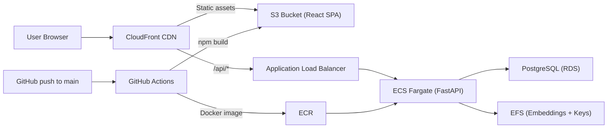

# Walkthrough — Cloud Deployment & Production Readiness

## Summary

Added three capabilities to make the chatbot fully deployable to production:

1. **CI/CD Pipeline** — automated build, deploy, and verify on every push to `main`
2. **Frontend Infrastructure** — S3 + CloudFront for hosting the React SPA globally with HTTPS
3. **JWT Authentication** — pluggable SSO (AWS Cognito, Auth0, Okta) with a dev-mode bypass

All changes pushed to GitHub: https://github.com/kishorekumar-2512/chatbot_v2

---

## Files Changed

### New Files (3)

| File | Purpose |
|------|---------|
| [deploy.yml](file:///c:/Users/kisho/OneDrive/Desktop/chatbot_v2/.github/workflows/deploy.yml) | GitHub Actions CI/CD — builds Docker images, pushes to ECR, deploys to ECS, builds React frontend, syncs to S3, invalidates CloudFront, triggers reindex, runs health check |
| [frontend.tf](file:///c:/Users/kisho/OneDrive/Desktop/chatbot_v2/deploy/terraform/frontend.tf) | Terraform for S3 bucket + CloudFront distribution with OAC. Routes `/api/*` to ALB, everything else to S3. SPA-compatible error handling |
| [auth.py](file:///c:/Users/kisho/OneDrive/Desktop/chatbot_v2/backend/auth.py) | JWT/JWKS authentication module. Fetches signing keys from any OIDC provider, verifies tokens, extracts user identity. Toggled via `REQUIRE_AUTH` env var |

### Modified Files (6)

| File | What changed |
|------|-------------|
| [main.py](file:///c:/Users/kisho/OneDrive/Desktop/chatbot_v2/backend/main.py) | Imported auth module, added `get_current_user` dependency to 13 routes, added `CLOUDFRONT_ORIGIN` to CORS |
| [client.js](file:///c:/Users/kisho/OneDrive/Desktop/chatbot_v2/web/src/api/client.js) | Added `getAuthHeaders()` — reads JWT from sessionStorage and attaches `Authorization: Bearer` header to all API requests |
| [requirements.txt](file:///c:/Users/kisho/OneDrive/Desktop/chatbot_v2/requirements.txt) | Added `PyJWT>=2.8.0` and `cryptography>=42.0.0` |
| [.env.example](file:///c:/Users/kisho/OneDrive/Desktop/chatbot_v2/.env.example) | Added `REQUIRE_AUTH`, `JWKS_URI`, `JWT_AUDIENCE`, `JWT_ISSUER`, `CLOUDFRONT_ORIGIN` |
| [variables.tf](file:///c:/Users/kisho/OneDrive/Desktop/chatbot_v2/deploy/terraform/variables.tf) | Added `frontend_domain_aliases` variable |
| [outputs.tf](file:///c:/Users/kisho/OneDrive/Desktop/chatbot_v2/deploy/terraform/outputs.tf) | Added `frontend_cloudfront_domain`, `frontend_cloudfront_distribution_id`, `frontend_s3_bucket` outputs |

---

## Architecture After Changes

---

## What Was Verified

| Check | Result |
|-------|--------|
| `from backend.auth import get_current_user, AuthenticatedUser` | ✅ Imports cleanly |
| Auth is no-op when `REQUIRE_AUTH=false` | ✅ Returns `None`, routes work unchanged |
| `/health` and `/circuit-status` remain public (no auth) | ✅ No dependency added |
| All changes committed and pushed to GitHub | ✅ Commit `3bdd579` |

---

## What You Need To Do Before First Cloud Deploy

1. **Set up AWS OIDC for GitHub Actions** — [GitHub docs](https://docs.github.com/en/actions/deployment/security-hardening-your-deployments/configuring-openid-connect-in-amazon-web-services)
2. **Run `terraform init` + `terraform plan`** in `deploy/terraform/` against your real AWS account
3. **Set GitHub repo secrets**: `AWS_ROLE_ARN`, `ECR_BACKEND_REPO`, `ECS_CLUSTER`, `ECS_SERVICE`, `S3_FRONTEND_BUCKET`, `CLOUDFRONT_DISTRIBUTION_ID`, `BACKEND_PUBLIC_URL`, `ADMIN_API_KEY`
4. **Choose your SSO provider** (AWS Cognito / Auth0 / Okta) and set `JWKS_URI`, `JWT_AUDIENCE`, `JWT_ISSUER` in the ECS task environment
5. **Push to `main`** — GitHub Actions handles the rest automatically
